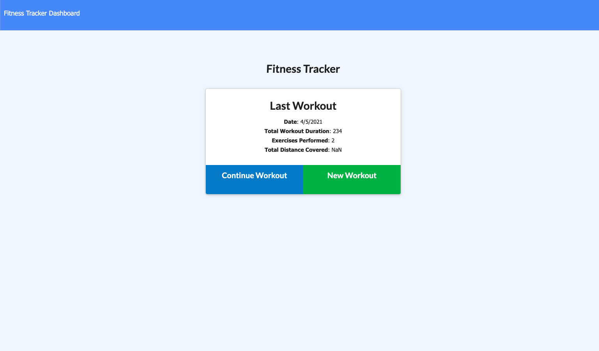
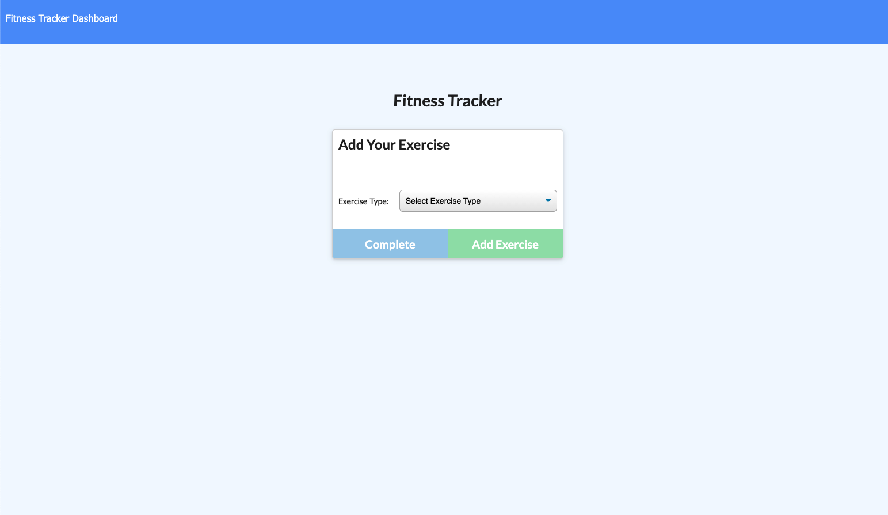
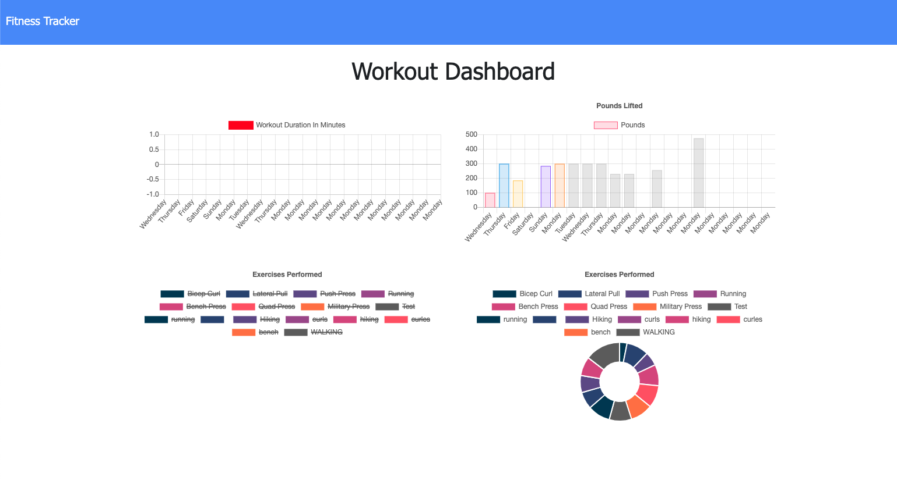

# workout-tracker
Workout Tracker built using a Mongo database with a Mongoose schema and handle routes with Express.

## Table of Contents

* [Requirements](#Requirements)
* [Installation](#Installation)
* [Contributing](#Contributing)

Homepage

Add-excercise

Dashboard

## Requirements

As a user, I want to be able to view create and track daily workouts. I want to be able to log multiple exercises in a workout on a given day. I should also be able to track the name, type, weight, sets, reps, and duration of exercise. If the exercise is a cardio exercise, I should be able to track my distance traveled.

## Installation

There is no need to install anything, to view the workout tracker simply follow the link below. 

See deployed site here: [Deployed site]() 

See repository here: [GitHub Repo](https://github.com/JD-Jaramillo/workout-tracker)

## Contributing

If you have any tips or ideas on how to improve the workout tracker please reach out to me directly. 

Email: Jaramillo784@gmail.com